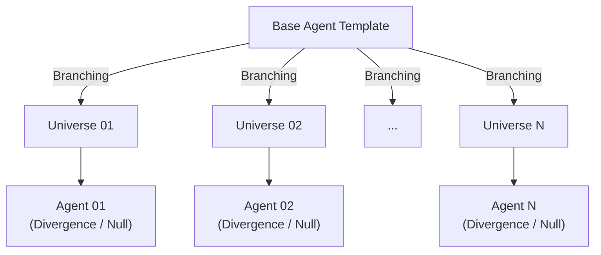
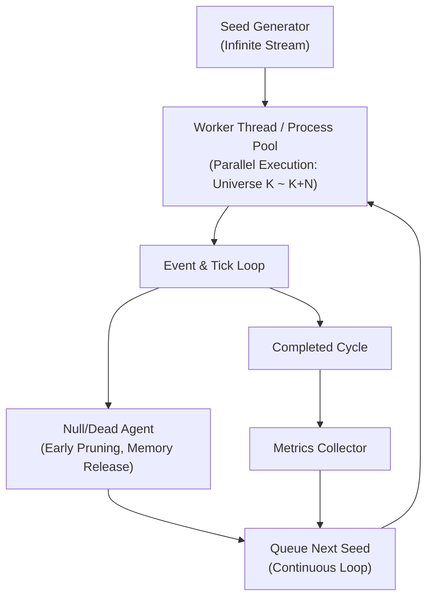

# Multiverse Agent Evolution & State Divergence Simulator

다중 우주 환경 변수에 따른 개체 성장 및 상태 분기 시뮬레이터

본 프로젝트는 다중 우주(Multiverse) 가설을 기반으로, 동일한 초기 상태(Genotype/Base State)를 가진 개체(Agent)가 독립된 우주 환경의 무작위 변수에 노출되었을 때 나타나는 성장 궤적, 성격 형성, 그리고 최종 상태의 분기 현상을 모사하고 통계적으로 분석하기 위한 시뮬레이션 엔진입니다.

## 목적 / 용도
개인 사고실험이자 동시성·알고리즘 설계 학습 프로젝트로 진행합니다. 6번의 무한 스트리밍 구조와 7번의 병렬/순차 하이브리드 실행 설계 자체가 학습 목적에 부합하고, 완성도가 올라가면 분기 트리·클러스터링 시각화를 중심으로 포트폴리오용 데모로 전환합니다. 통계적 엄밀성보다 구조 설계와 시각화 완성도를 우선순위로 둡니다.

## 1. Project Overview (프로젝트 개요)
- **핵심 질문**: 무한에 가까운 다중 우주가 존재할 때, 동일한 근원을 가진 '나'라는 개체는 환경 변수와 미시적 확률에 따라 어떻게 다르게 성장하고 변이하는가?
- **목적**:
  - 초기 조건과 외부 파라다임 변화에 따른 에이전트의 동적 발달 궤적(Growth Trajectory) 추적
  - 독립된 N개의 가상 우주(Thread/Context) 내 실행 결과 분석
  - 개체 생존 여부, 성격 변화, 최종 상태 분기율에 대한 정량적 통계 도출

## 2. Theoretical Framework (이론적 배경)
- **다세계 해석 (Many-Worlds Interpretation)**: 관측 또는 확률적 사건이 일어날 때마다 우주의 상태가 새로운 분기(Branch)로 갈라지는 메커니즘 채택
- **동적 에이전트 성장 모델 (Dynamic Agent Evolution)**: 초기 상태값을 공유하는 에이전트가 우주별 변수에 따라 매 시간 단위(Tick)마다 보상과 피드백을 받아 상태를 업데이트하는 구조
- **환경 상수 Variation (Environmental Variance)**: 각 우주의 물리/사회적 상수를 결정론적·확률론적 파라미터로 주입하여 성장 조건 제어

## 3. Architecture & Key Concepts (시스템 구조)

- **Universe Context**: 물리 법칙, 생존 난이도, 부모 유전자 결합 확률, 사회적 이벤트 빈도 등을 보유한 독립적 시스템
- **Agent State Engine**: 유전적 기본값(Base DNA), 성격 지표(Persona Matrices), 지능, 경험치, 생존 여부(IsAlive)를 관리하는 개체 객체
- **Branching Event Manager**: 특정 시점(예: 탄생, 환경 변혁, 중대 선택)에 우주 상태를 복제하고 독립적인 무작위 시드값(Seed)을 부여하는 엔진

## 4. Experimental Design (구체적 실험 설계)
### Phase 1: Initialization & Branching
- 동일한 초기 상태 파라미터 `Agent_Base` 정의
- N개의 독립된 우주 인스턴스를 배열 및 스레드 단위로 동시 초기화
- 각 우주마다 별도의 난수 시드(PRNG Seed) 지정

### Phase 2: Environmental Perturbation & Growth Process
- **생성 단계 (Genesis)**: 특정 우주에서는 부모 만남 실패 또는 유전 조합 실패 조건으로 인한 '개체 존재 불능(Null/Not Born)' 처리
  - > **노트**: 탄생 실패 판정도 반드시 우주 seed에서 결정론적으로 뽑아야 재현성이 보장됩니다. 실행 순서/스레드 스케줄링과 무관하게 우주 $U_k$는 항상 같은 결과를 내야 합니다.
- **성장 단계 (Growth Loop)**: 매 시간 단위(Tick)마다 지정된 이벤트 매트릭스 실행 — 사회적 자극, 물리적 환경 변화, 무작위 사고 발생 → 에이전트의 내부 성격 파라미터(예: 외향성, 안정성, 위험 선호도) 재계산
  - > **노트**: 성격 업데이트 규칙 $f$는 반드시 **유계(bounded)** 로 설계해야 발산 지표가 해석 가능합니다. 예) 각 성격 차원을 $[0,1]$로 클램프하거나 로지스틱 변환 + 평균회귀(mean-reversion) 항 포함. 그렇지 않으면 값이 무한정 커져 클러스터링이 무의미해집니다.

### Phase 3: Trajectory & State Divergence Tracking
- $T_{\text{end}}$ 시점까지 생존한 에이전트들의 최종 스탯 및 성장 이력 수집
- 코사인 유사도(Cosine Similarity) 및 거리 계산 알고리즘을 통한 원본 `Agent_Base`와의 격차 산출
  - > **노트**: 코사인 유사도는 벡터의 **방향만** 보고 크기를 무시합니다. "전 성향이 전반적으로 높아졌다/낮아졌다" 같은 크기 차이가 중요하면 코사인은 그 정보를 잃습니다. 성격 차원별 스케일이 다르면 **z-score 정규화 후 유클리드 거리**를 쓰거나, 둘 다 리포트하는 걸 권장합니다. 무엇을 feature로 볼지(최종 성격만 / 전체 궤적 / 요약 통계)도 먼저 정해야 합니다.

## 5. Metrics & Analytics (분석 지표)
- **Existential Rate ($R_{\text{exist}}$)**: 전체 N개 우주 중 에이전트가 최종까지 존재 및 생존한 비율
  - 정의: $R_{\text{exist}} = n_{\text{alive@}T_{\text{end}}} / n_{\text{explored}}$
  - > **중요**: 분모는 **탐색한 전체 우주 수**입니다. Early pruning으로 걸러낸 NOT-BORN/조기 사망 우주를 분모에서 빼면 $R_{\text{exist}}$가 1로 편향됩니다. Metrics Collector가 pruned 우주도 카운트해야 합니다.
- 세 결과를 구분해서 각각 비율로 리포트하는 걸 권장:
  - $R_{\text{born}}$ = 한 번이라도 ALIVE가 된 비율 (탄생률)
  - $R_{\text{terminated}}$ = 태어났으나 $T_{\text{end}}$ 전에 사망한 비율
  - $R_{\text{exist}}$ = 끝까지 생존한 비율
- **Identity Similarity Index ($S_{\text{identity}}$)**: 기준 우주의 에이전트와 비교했을 때 최종 상태(성격, 능력치)의 유효 일치율 (유사도 metric은 4번 노트 참조)
- **Divergence Spectrum**: 에이전트 성장 궤적이 분기된 형태의 클러스터링 결과

## 6. Mathematical & System Logic for 'Infinity' (무한의 로직 및 알고리즘 구현)
실제 시스템 자원의 한계를 극복하고 이론상 '무한(Infinity)'에 가까운 다중 우주를 시스템적으로 모사하기 위해 다음과 같은 알고리즘적 구조를 채택합니다.

### 6.1. Infinite Representation Logic (무한 공간 표현)
**Lazy Evaluation & Procedural Generation (절차적 우주 생성)**
- 모든 우주를 동시에 메모리에 로드하지 않고, 2^64 이상 공간을 가지는 64-bit PRNG Seed(예: PCG64 / Xoshiro256++)를 매핑
- 우주 $U_k$의 물리 법칙, 환경 변수, 사건 발생 분포는 모두 `Seed(k)`로부터 필요 시점에 동적으로 생성(Determined-on-demand)되므로 O(1)의 메모리 공간으로 무한에 가까운 공간을 표현
- > **재현성 설계**: 병렬 실행에서 실행 순서와 무관하게 우주 $U_k$가 항상 같은 시드를 받도록, master seed에서 **분할 가능(splittable)** 방식으로 파생시켜야 합니다. NumPy `SeedSequence.spawn(k)` 또는 counter-based PRNG(Philox 등)를 쓰면 워커/순서에 무관하게 $U_k$의 시드가 결정됩니다. 워커가 즉석에서 `random()`을 호출해 시드를 만들면 재현성이 깨집니다.

**Monte Carlo Convergence Engine (통계적 수렴 제어)**
- 고정된 N번의 반복 대신, 탐색된 우주들에서 '나와 거의 동일한(ε-근방) 개체가 발견될 확률' 및 '성격 분기 스펙트럼의 안정성'을 실시간 추적
  - > **개념 수정**: "100% 동일"은 성격 벡터가 연속값이면 확률 0(측도 0)이라 절대 관측되지 않습니다. **"base와의 거리 < δ인 ε-근방 개체"** 로 재정의해야 측정 가능한 사건이 됩니다.
- 아래 표준오차 SE 조건은 **단일 비율 지표 하나**(예: $R_{\text{exist}}$)에만 깔끔하게 적용됩니다:

$$SE = \sqrt{\frac{p(1-p)}{n}} < \epsilon$$

(p: 관측된 비율, n: 탐색한 우주 수, ε: 목표 오차 한계)

- > **수렴 기준 분리**: 위 SE 공식은 **베르누이 비율 하나**를 추정할 때의 기준입니다. "분기 스펙트럼의 신뢰구간"은 단일 비율이 아니라 **분포**라서 이 공식으로는 못 잡습니다. 분포 수렴은 별도 기준이 필요합니다 — 예) 배치를 늘려도 클러스터 중심(centroid)이 안 움직임, 또는 직전 배치와 현재 배치의 경험적 분포 간 KS 거리 < 임계값. 즉 **스칼라 지표는 SE, 분포 지표는 안정성 기준**으로 이원화합니다.
- > **N 규모 계산(10번과 연결)**: 단일 비율 $\epsilon=0.05$ 기준이면 최악($p=0.5$)에서 $n > p(1-p)/\epsilon^2 = 0.25/0.0025 = 100$. 즉 $R_{\text{exist}}$ 하나만 보면 우주 ~100개로 충분합니다. **무한 스트리밍이 실제로 필요해지는 경우는 희귀 사건 추정** 입니다 — ε-근방 개체 확률 $p$가 작으면 상대오차를 잡기 위해 $n$이 폭증합니다. 상대오차 5% 기준 $n \ge (1-p)/(0.0025\,p)$이므로 $p=0.01$이면 $n \approx 39{,}600$. 이 프로젝트에서 희귀 사건 확률을 정밀 추정할 계획이 아니라면 무한 스트리밍은 과설계일 수 있습니다.

## 7. Execution Architecture: Sequential vs Parallel (실행 및 동시성 구조)
시스템 자원 효율을 최대화하고 무한 확장성을 보장하기 위해 Hybrid Stream & Pool Architecture를 적용합니다.

### 7.1. Execution Pipeline Options
**Parallel Execution Phase (동시 병렬 실행 - 인프라 임계치 제한)**
- 적용 시점: 특정 기점 $T_0$에서 양자 분기(Branching)가 일어나는 직후 N개 우주
- 구현: Thread Pool / Process Pool을 통한 CPU 코어 단위 Parallelism
- N개의 우주가 독립된 Context로 병렬 진화하며, 우주 간 공유 자원 잠금(Locking)을 최소화하기 위해 메시지 파싱(Lock-free Queue) 방식 적용
- > **GIL 주의**: 이 시뮬레이션 루프는 순수 CPU 연산이라, 파이썬 프로토타입에서 **일반 스레드 풀은 GIL 때문에 병렬화가 안 됩니다**(코어 하나만 씀). CPU 병렬을 실제로 얻으려면 `ProcessPoolExecutor`(멀티프로세스)를 쓰거나 Numba `@njit(nogil=True)`로 GIL을 풀어야 합니다. I/O 바운드 작업이 아니라는 점이 핵심 차이입니다.

**Sequential Queue Phase (순차 스트리밍 실행 - 무한 탐색 처리)**
- 적용 시점: 동시 병렬 인프라 스레드 수를 초과하는 대규모/무한 우주 탐색 시
- 구현: 하나의 Worker가 Seed → Simulation Loop → State Dump → Resource Reset 단계를 순차적/배치(Batch)로 실행. 메모리 복잡도는 단일 우주 실행 수준인 O(1)로 고정

**Early Pruning & Garbage Collection (조기 가지치기)**
- 생성 단계(Genesis) 또는 성장 과정(Growth Loop)에서 부모의 불일치, 유전 조합 실패, 치명적 사고로 인해 개체가 생존 불가능(Null/Dead)해진 우주는 즉시 시뮬레이션을 중단하고 메모리를 반납
- > **집계 정합성**: pruning으로 계산을 아끼는 건 좋지만, 프루닝된 우주도 Metrics Collector의 카운터($n_{\text{explored}}$, $n_{\text{not\_born}}$ 등)에는 **반드시 반영**해야 합니다(5번 중요 노트). "중단"은 시뮬 루프만 끊는 것이지 통계에서 빼는 게 아닙니다.

> **설계 긴장(vectorize vs stream)**: NumPy로 가장 빠른 방식은 "우주 N개의 tick $t$를 배열로 한 번에 갱신"하는 **우주 축 벡터화**입니다. 그런데 이건 고정 배치라서 우주별 early pruning/무한 스트리밍과 상충합니다. 절충안은 **워커가 맡은 청크(batch) 단위로만 벡터화**하고, 청크 안에서 죽은 우주는 마스킹 처리하는 것입니다. 프로토타입은 이 배치-벡터화가 구현 난이도 대비 속도가 제일 좋습니다.

## 8. Data Model & State Machine (상태 머신 및 데이터 구조)
### 8.1. Agent State Matrix
$$A_{\text{state}}(t) = (\text{DNA}_{\text{base}}, P(t), \text{Status})$$

$$P(t) = [P_{\text{extroversion}}, P_{\text{neuroticism}}, P_{\text{risk-tolerance}}, \dots]^T \quad \text{(동적 변형 성격 매트릭스)}$$

$$\text{Status} \in \{ \text{NOT-BORN}, \text{ALIVE}, \text{TERMINATED} \}$$

### 8.2. State Transition Function
$$A_{\text{state}}(t + \Delta t) = f\left( A_{\text{state}}(t), E_{\text{universe}}(t, \text{Seed}_k) \right)$$

$E_{\text{universe}}$: 해당 우주의 환경 변수 및 무작위 자극 이벤트 벡터

### 8.3. 핵심 변수 카탈로그 (Variable Catalog)
구현 전에 확정해야 할 변수들을 4개 그룹으로 정리합니다. 타입/기본값은 파이썬 프로토타입 기준 예시입니다.

**A. 에이전트 상태 (Agent State)**

| 변수 | 타입 | 설명 |
|---|---|---|
| `dna_base` | `float[D]` | 모든 우주가 공유하는 초기 유전 벡터. 불변. `D` = 유전자 차원 수 |
| `persona` | `float[K]` | 동적 성격 벡터 `[외향성, 신경성, 위험선호, ...]`. `[0,1]` 클램프. `K` = 성격 차원 수 |
| `intelligence` | `float` | 지능/능력치 |
| `xp` | `float` | 누적 경험치 |
| `age` | `int` | 현재 tick |
| `vitality` | `float` | 생존력/체력. 0 이하 → `TERMINATED` |
| `status` | `enum` | `{NOT_BORN, ALIVE, TERMINATED}` |
| `trajectory` | `list` | (선택) tick별 persona 스냅샷. 메모리 크므로 샘플링 저장 권장 |

**B. 우주 / 환경 (Universe Context)** — 전부 `seed`에서 결정론적으로 파생

| 변수 | 타입 | 설명 |
|---|---|---|
| `seed` | `uint64` | 우주 고유 PRNG 시드 (master에서 spawn) |
| `survival_difficulty` | `float` | 생존 난이도. tick당 사망 확률 스케일 |
| `parent_match_prob` | `float` | 부모 만남/유전 결합 성공 확률 → 탄생 여부 결정 |
| `event_freq` | `float` | tick당 사회적 이벤트 발생 강도 |
| `accident_rate` | `float` | tick당 치명적 사고 확률 |
| `env_variance` | `float[·]` | 환경 자극 벡터의 분산 파라미터 |
| `growth_coeffs` | `float[·]` | 물리/사회 상수(성장·보상 계수) |

**C. 시뮬레이션 설정 (Global Config)**

| 변수 | 타입 | 설명 |
|---|---|---|
| `master_seed` | `int` | 최상위 시드 (SeedSequence 루트) |
| `N` | `int` | (고정 모드) 탐색 우주 수 / (무한 모드) 상한 |
| `T_end` | `int` | 우주당 최대 tick |
| `dt` | `float` | tick 간격 (보통 1) |
| `epsilon` | `float` | 목표 표준오차/수렴 한계 |
| `pool_size` | `int` | 병렬 워커 수 |
| `batch_size` | `int` | 워커 청크 크기 (배치-벡터화 단위) |
| `check_interval` | `int` | 수렴 판정 주기 |

**D. 통계 / 집계 (Metrics)**

| 변수 | 타입 | 설명 |
|---|---|---|
| `n_explored` | `int` | 탐색한 전체 우주 수 (모든 비율의 분모) |
| `n_not_born` / `n_alive_end` / `n_terminated` | `int` | 결과별 카운터 |
| `R_born` / `R_terminated` / `R_exist` | `float` | 결과별 비율 |
| `p`, `SE` | `float` | 관측 비율과 표준오차 |
| `S_identity` | `float` | base 대비 최종 유사도 |
| `cluster_labels`, `centroids` | `int[]`, `float[][]` | 분기 스펙트럼(클러스터링 결과) |

## 9. 기술 스택 (Tech Stack)
1단계 프로토타입은 **Python + NumPy/Numba(연산) + Plotly(분기 트리·클러스터링 시각화)**로 빠르게 구조를 검증합니다. 구조가 자리잡고 N을 키울 필요가 생기면, O(1) 메모리 무한 스트리밍 구조의 이점을 제대로 살리기 위해 **C++ (또는 Rust) + 스레드 풀**로 코어 시뮬레이션 루프만 이식합니다 — dvd의 C++ 시스템 프로그래밍 경험과도 맞는 방향입니다. 시각화·분석 레이어는 Python에 남겨 개발 속도를 유지합니다.

> **동시성 주의(7번 GIL 노트와 연결)**: 파이썬 단계에서 CPU 병렬이 필요하면 `ProcessPoolExecutor` 또는 Numba `nogil` 스레드를 쓰세요. 일반 `ThreadPoolExecutor`는 이 순수-연산 루프에서 코어 하나만 사용합니다. C++/Rust로 넘어가면 이 제약이 사라지므로, 병렬화의 실이득은 사실상 코어 이식 이후에 큽니다.

## 10. 실행 규모 견적
1단계 프로토타입 목표는 **N=1,000, ε=0.05**로 잡고 노트북에서 몇 분 내 완료되는지부터 확인합니다. 우주 1개당 1000 tick, 상태 갱신 O(1) 연산 기준이면 총 약 $10^6$회 갱신으로, 단일 스레드로도 수 초 내(NumPy 벡터화 시 1초 미만) 처리가 가능할 것으로 예상됩니다.

> **규모 계산 정정**: ε=0.05를 **단일 비율**($R_{\text{exist}}$) 기준으로 보면 최악($p=0.5$)에서도 우주 ~100개면 충분합니다($n > 0.25/0.0025 = 100$). N=1,000이면 $SE = \sqrt{0.25/1000} \approx 0.0158$로 목표의 1/3 수준이라 오히려 여유가 큽니다. 즉 **N=1,000을 정당화하는 근거는 생존율이 아니라 (1) 분기 스펙트럼/클러스터 해상도와 (2) 희귀 near-identical 사건 추정**입니다(6.1 계산 참조). 이 실측으로 판단할 것: N을 더 늘릴지, 아니면 이 프로젝트 성격상 소규모로 충분해서 무한 스트리밍 구조가 굳이 필요 없는지.

## 11. 구현 순서 (Implementation Roadmap)
원칙: **정확성 → 통계 → 시각화 → 성능 → 확장**. 무한 스트리밍/병렬화는 뒤로 미루고, 먼저 "단순하지만 정확한" 고정-N 버전을 세운 뒤 필요할 때만 복잡도를 올립니다. Phase 0~2만 끝나도 포트폴리오용 데모로는 완성이고, Phase 3부터는 최적화·확장 영역입니다.

### Phase 0 — 코어 & 단일 우주 (정확성 먼저)
- 데이터 구조 확정: Agent 상태 / Universe 환경 / 전역 설정 (8.3 카탈로그 기준)
- `seed → 환경 변수` 결정론적 생성 함수 구현
- 단일 우주 시뮬레이션 완성: genesis 판정 → growth loop → 최종 상태
- **재현성 테스트**: 같은 seed → 같은 결과인지 검증 (이게 통과돼야 다음 단계 의미 있음)

### Phase 1 — 고정 N 몬테카를로 (무한/병렬 아직 X)
- `SeedSequence.spawn(N)`로 독립 시드 N개 생성 → 단일 스레드 루프 실행
- Metrics Collector: 분모에 pruned(NOT_BORN/조기사망) 포함해서 $R_{\text{born}}/R_{\text{terminated}}/R_{\text{exist}}$ 집계
- 유사도/발산: feature 벡터 정의(최종 성격 / 궤적 / 요약통계 중 택) → $S_{\text{identity}}$, base와의 거리

### Phase 2 — 분석 & 시각화
- 최종 상태 클러스터링(분기 스펙트럼) + Plotly 분기 트리/클러스터 뷰
- 환경 파라미터 튜닝: 발산이 너무 없지도(전부 base와 동일), 완전 카오스도 아니게 조정

### Phase 3 — 병렬화
- 고정-N 루프를 `ProcessPool` 또는 Numba `nogil`로 병렬 (미리 spawn한 시드 재사용 → 재현성 유지)
- 배치-벡터화 적용(7번 설계 긴장 노트)
- 단일 스레드 대비 벤치마크로 실이득 확인

### Phase 4 — 무한 스트리밍 + 수렴 제어 (필요할 때만)
- producer(시드 생성) → worker pool → Metrics 실시간 추적 구조로 전환
- 종료 조건: **스칼라 지표 SE < ε** AND **분포 안정성 기준**(centroid 고정 or KS 거리 < 임계) 동시 충족
- early pruning + 메모리 반납을 스트리밍 루프에 통합

### Phase 5 (선택) — C++/Rust 코어 이식
- N을 크게 키워야 하거나 희귀 사건 정밀 추정이 필요할 때만 hot loop 이식
- 시각화·분석 레이어는 Python에 유지

> **의사결정 게이트**: Phase 1 실측(10번)에서 "N=1,000으로 CI가 이미 충분히 좁다"가 나오면 Phase 4(무한 스트리밍)는 스킵 후보입니다. 학습 목적으로 만들고 싶으면 별도 브랜치에서 진행하고, 메인 데모는 고정-N으로 유지하는 걸 권장합니다.